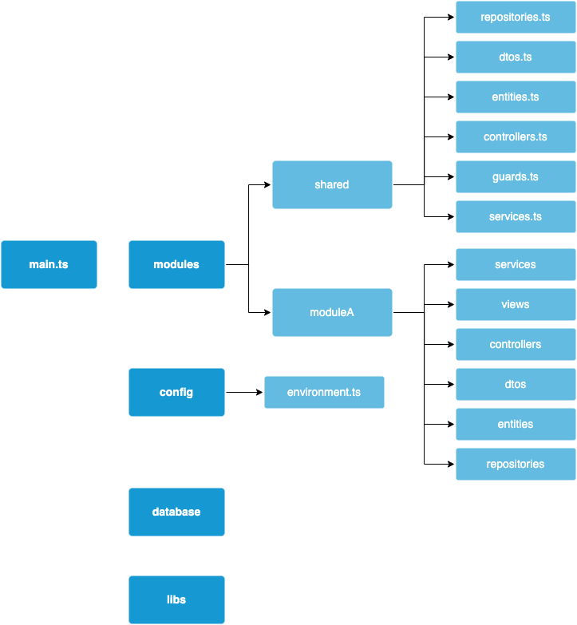
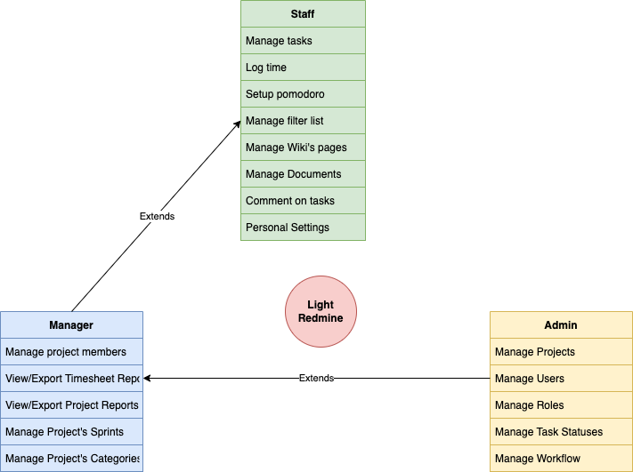
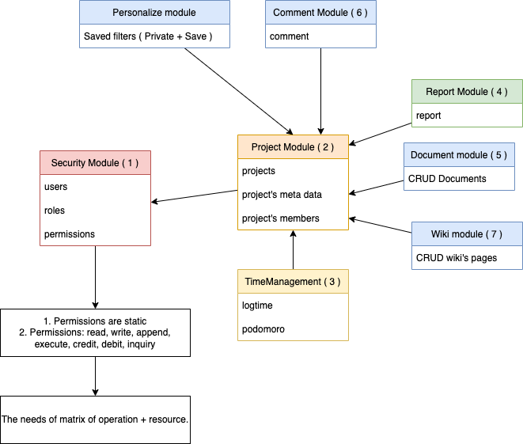
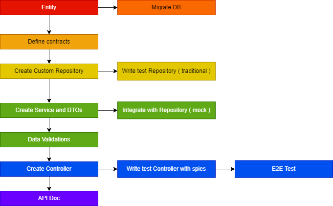
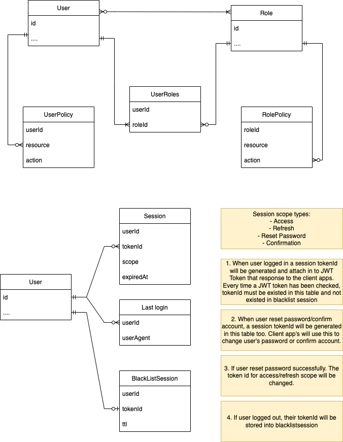

# NestJS Playground

**Version** : 8.2.5
**Node** : 16.14.2
**Architecture** : Monolith + Modular + MVC

## Getting start

```bash
cp .env.sample .env
yarn start:dev
```

### CLI

```bash
nest g module example
nest g controller example/controllers/example --flat
nest g controller user/controllers/user --flat --no-spec
```

## Folder structure



## TypeORM CLI

### Migration

```bash
yarn typeorm migration:create -n set-default-charset
yarn typeorm migration:generate -n create-user-table
yarn typeorm migration:run
```

### Drop

```bash
yarn typeorm schema:drop
```

## Functionals



## Priorities



## Codefirst Flow



## Database

### Example Entity

```ts
export class BaseEntity {
  @Expose()
  @PrimaryGeneratedColumn()
  id: number;

  @Expose()
  @CreateDateColumn({ type: 'timestamp', nullable: true })
  createdAt: Date;

  @Expose()
  @UpdateDateColumn({ type: 'timestamp', nullable: true })
  updatedAt: Date;
}

import { BaseEntity } from 'src/shared/entities';
import { generateTableName } from 'src/shared/helpers';
import { Column, Entity } from 'typeorm';

export enum ExampleGender {
  UNKNOWN = 0,
  FEMALE = 1,
  MALE = 2,
}

@Entity({
  name: generateTableName('examples'),
})
export class Example extends BaseEntity {
  @Column('varchar', { length: 60 })
  firstName: string;
  @Column('varchar', { length: 60, nullable: true, default: '' })
  lastName: string;
  @Column('enum', { enum: ExampleGender, enumName: 'ExampleGender' })
  gender: ExampleGender;
  @Column('varchar', { length: 60 })
  jobArea: string;
  @Column('varchar', { length: 60 })
  jobDescriptor: string;
  @Column('varchar', { length: 60 })
  jobTitle: string;
  @Column('varchar', { length: 60 })
  jobType: string;
  @Column('varchar', { length: 60 })
  prefix: string;
  // "BLOB, TEXT, GEOMETRY or JSON column 'content' can't have a default value",
  @Column('text', { nullable: true })
  content: string;
  @Column('blob', { nullable: true })
  avatar: string;
  @Column('boolean', { nullable: true, default: true })
  active: boolean;
  @Column('bigint', { nullable: true, default: 0 })
  net: number;
  @Column('float', { nullable: true, default: 0.0 })
  netIncomeRatio: number;
  @Column('date', { nullable: true, default: '1970-01-01' })
  dateOfBirth: Date;
  @Column('timestamp', {
    precision: 6,
    default: () => 'CURRENT_TIMESTAMP(6)',
    nullable: true,
  })
  bookingTime: Date;
}
```

```sql
INSERT INTO `nestjs_examples` (`id`, `createdAt`, `updatedAt`, `firstName`, `lastName`, `gender`, `jobArea`, `jobDescriptor`, `jobTitle`, `jobType`, `prefix`, `content`, `avatar`, `active`, `net`, `netIncomeRatio`, `dateOfBirth`, `bookingTime`) VALUES (NULL, NULL, NULL, 'TCName', NULL, '1', 'test', 'test', 'test', 'test', 'test', 'test', 0x89504e470d0a1a0a0000000d49484452000002a9000001a50806000000d90c6f21000000017352474200aece1ce90000200049444154785eedbd7b9c5c5595f7bd2a74bad32dcd259d00e12278e3a2c2a801155054501f9d9178779ec1db9319c98c3218937849673232381913463bdaf27a79449f8ca3e83b2a789d91d701152f8040d41701b9895c9400a163204093a6937e3eabca5dbdebe49caa5355a76aaf3ae7dbff40579fb3f75adfb5f7d9bfb3f6da95d2b74566841f08402091c0e93376a7c855cf2d11390840a00e81e75f6d77fe12380840a03e81928ad4c50bc0040108c411d8fc80887591ba7831b183000462e7ef6611442a630302bd4b0091dabbb1c3f22e1040a47601325d40a043043623523b44966621d01d0288d4ee70a6971e258048edd1c0613604440491ca3080406f1340a4f676fcb0bec30410a91d064cf310e82001446a07e1d23404ba400091da05c874d1bb0410a9bd1b3b2c87002295310081de268048ededf8617d870920523b0c98e621d0410288d40ec2a5690874810022b50b90e9a2770920527b3776580e01442a630002bd4d0091dadbf1c3fa0e1340a4761830cd43a0830410a91d844bd310e80201446a1720d345ef1240a4f66eecb01c028854c600047a9b0022b503f11b7cd35b65bff33e29a5bd876b5a9f999a9287cf3f4f766cf86062afc3ab3f244f58fa4e79f01f574adf939f16fbff935ffd6207aca6c9380288d4de1c17b76c1739e3bf459e77a0c8474f1219ecabf831392df2de2b447e7e9fc8975f56f9ec43d78a8cbf4064645efbbe4e3c26b2fca7221f3c5ee4c8fdd2b7f72f9b45cebda6f6fa734e10f9873ffd430ddaeedb2f13f9feddb3d71c3752f1a1997ed25b948f2b11a9f988235e14970022b503b1772275f25b5f95edef7947533df822d517a3499f37d53817374d20b4481d1b1b9365cb96c9f070ed0b8f7344ff5954fec5a93dc3aa2275c5cf44f6eb1751b1e7849c7eae6270fb94c8c74ece5ee0b52352d50b274a9d983ef80995cf9c485db358e4a4832afe7ee556919f6ea915e14d0ff09cdf8048cd7980712ff70410a91d08712391ea04e7ccce9db2d7a243ca163c7ae1e765e715975733b0330fef909d3ff981f43fef6499fcce4532f4fa33ca9959fd7cf78e8764fad69b64e2f52f2ddf3b72d1a5e5ffbadf3be052619b0c2d5207070765d7ae5db26ad52a59b366cd1e6215911a3f34558c6a86f48403440e1814f9aba7cd0abbfb2745aeb9bf92edd41f3f93aac24f33969aa57cd961227bcf1559f96795ecebf69d225ffbadc88f5e2372d47eb5994d15c2eeba0b6eacdcaf59cec3f6aedcab9fe98fdeeb44a66fb966527d91aaffef84b68a69cdf2aa5dbe48753e669505cee32447a4e631aaf854240288d40e443b8d48ddfbec0fc8d4553f290bcb037e7a8394f6d957b69ff536e93ff9c50db7fb074e7a910c9cfa8af2f5fab3dfc72e9047bf7e61dd32820eb8598826438bd4f1f17159bd7ab5ecdebd5b4aa592ac58b1a246ac2252eb8bd4bf7caac8257755b28d4e909e7e84c8a7aedf53a46ab652b3afbe283cf1a059f1e9b29a2ecbf9824515f11b1593fe76bf2f3eafb857e4dd3f89dfa28f13a9ae9f371f392b8aa399d4db1f9acdbe16624236e92422b549605c0e01630410a91d0848524deaae2d7fa80ad1bdfff63df2f0fffe785958eef7f1cf5545671a91aa26efb376bd3cb46eb45cb73af48637cbf615679633affc644b20b448556f46464664dbb66d65c7fafbfb6bc4ea0da7edc3767f4cc85d9651339cbabdefb2a69b6e12f9fb63453e70e59e2255eb3d7dd1a75955fddd65489d288d76e76ff16bc6d389d468f6d3179dd16c6a5a91ead7a4befc30912f9c964d2d6db6b3c64e6b88543bb1c01208b4420091da0ab506f7a4c9a4bac3515a77daac48d57b34fb3a75ed95b2d7614794ad61abbf0381d47ffbfb0191259d69baad56e7ce9d2b4b962c91f7de751122b58e48d5adf0cfdc20f2924344eedc51119d7ff78c5921e9b2abee3afdddd5854645aa66349db8d4ace88bbf39dbb1dbde8f13a9beb0d43b5458baf203d7429c48f5eb505d794174bbdf657e393c153f9d10a96d3d66b81902c10920523b10826e88d4b2b07dc14bcad6b3d5df8120fea9490b99d4050b16c8c4c444d92232a9e962edd76bdebc5de43b77883c3425e2b6ce5db6d317a98d32a94ea4460f31d5cba4a63de9df4a4d6abdcc6c3a4af9bf0a919aff18e361be0920523b10df6e8854d7871ea2d2da54b6fa3b10c83f65524f9f99e94ce3295ad59ad4d1d1d1f2e1296a525300fbd325be485511a95f4775d050258ba93f7122b5514d6a9248d58cebd8af2ab5a67e2655b39bbef8745f8bf58917ee79782a2a52d39ceef76b61c9a492494d3f3bb81202bd430091da815825d5a496b39e177e5e76dd7b4ff5705474bb7fcea243ca27fcf5c79deed7ef4cd51ff7f9f60f9c256ecb7fd77d5bd8eaef400c5d93a133a99cee6f2db8be481deaab9cb0f7bfce294ea4aac074a7fbb5de534ff73ffcf86c4daabfddefae53eb3e758ac82f1fa864699fbda0f67b58a3a7fbe3b6fab58d56be2755ef4bfab680d6a8e5ef2e32a9f98b291e158b0022b547e3ad4278df7fde288f6cfa34a7fa3b18c3d02295ef49ed6070eb341d3dc11fc60a7a6d970022b55d82dc0f81b00410a961f9b7d4bb7ecfaaff15562d35c24da9088416a98d8ce42ba81a114afff7e86128ff5f7c4adf0a575a228048b5140d6c8140f30410a9cd33e38e021140a41628d8b89a3b0288d4dc8514870a4600915ab080e36e730410a9cdf1e26a0858228048b5140d6c8140f30410a9cd33e38e021140a41628d8b89a3b0288d4dc8514870a4600915ab080e36e730410a9cdf1e26a0858228048b5140d6c8140f30410a9cd33e38e021140a41628d8b89a3b0288d4dc8514870a4600915ab080e36e730410a9cdf1e26a0858228048b5140d6c8140f30410a9cd33e38e021140a41628d8b89a3b0288d4dc8514870a4600915ab080e36e730410a9cdf1e26a0858228048b5140d6c8140f30410a9cd33e38e021140a41628d8b89a3b0288d4dc8514870a46a02c520be633ee42a02902a7cfd89d22fa2f4ef1030108241378fed576e72f71830004ea1328cdcc185e810b18bd52a92484a48081c76508400002108000046a0820528d0d0844aab180600e04200001084000024108205283604fee14916a2c2098030108400002108040100288d420d811a9c6b0630e0420000108400002c6082052ad05849a546311c11c0840000210800004421040a486a05ea74fb6fb8d0504732000010840000210084200911a043bdbfdc6b0630e0420000108400002c6082052ad0584ed7e6311c11c0840000210800004421040a486a0ce76bf31ea98030108400002108080350288546311a126d5584030070210800004200081200410a941b027778a48351610cc8100042000010840200801446a10ec885463d831070210800004200001630410a9d602c2c1296311c11c0840000210800004421040a486a05ea74fb6fb8d0504732000010840000210084200911a043bdbfdc6b0630e0420000108400002c6082052ad0584ed7e6311c11c0840000210800004421040a486a0ce76bf31ea98030108400002108080350288546311a126d5584030070210800004200081200410a941b027778a48351610cc8100042000010840200801446a10ec885463d831070210800004200001630410a9d602c2c1296311c11c0840000210800004421040a486a05ea74fb6fb8d0504732000010840000210084200911a043bdbfdc6b0630e0420000108400002c6082052ad0584ed7e6311c11c0840000210800004421040a486a0ce76bf31ea98030108400002108080350288546311a126d5584030070210800004200081200410a941b027778a48351610cc8100042000010840200801446a10ec885463d831070210800004200001630410a9d602c2c1296311c11c0840000210800004421040a486a05ea74fb6fb8d0504732000010840000210084200911a043bdbfdc6b0630e0420000108400002c60820520307646c6c4cd6ae5d2b1b366c90e5cb978bcba48e8f8fcbead5ab65ddba75b26ad5aac056d23d042000010840000210e82e01446a7779efd1db8e1d3b64646444fafafa6468684826262664fefcf932393929d3d3d3e5df878787035b49f7108000042000010840a0bb0410a9dde51ddbdbe8e8a86cdcb851a6a6a6aa7fefefef97952b57cafaf5eb0d588809108000042000010840a0bb0410a9dde51ddb9b6653172e5c283b77eeacfe7d606040b66edd4a16d5407c30010210800004200081ee1340a4769f79c36c2a59542341c10c0840000210800004821140a406435fdbb19f4d258b6a242898010108400002108040300288d460e8f7ec586b53f5b4bf9ee6a716d5506030050210800004200081ae1340a4761d7972879a4d5dba74a96cdab4895a544371c1140840000210800004ba4fa074d97b64a6fbddd223047a87c0a91f638af44eb4b0140210800004f242a02c52172f1eca8b3ff801814c096cdefca8205233454a6310800004200081540410a9a9307151510920528b1a79fc860004200081d00410a9a12340ffa60920524d8707e3200001084020c70410a9390e2eaeb54f0091da3e435a80000420000108b4420091da0a35ee290c01446a61428da31080000420608c0022d5584030c7160144aaad78600d042000010814870022b538b1c6d3160820525b80c62d108000042000810c08205233804813f9258048cd6f6cf10c02108000046c1340a4da8e0fd6052680480d1c00ba870004200081c212288448bd75cb6e59faff4cc9f577edae06fa994f9c239bfebe5f9eb6684ec3e0ffeb371f970f5ff4b8bcedc57da2ff3ed719a7f4c9f38f6c7c5fc38633bc60dbc333f2be2f4cc9ead7cd4de553a3aeb36eaf517f56ff8e48b51a19ec820004200081bc13288c48fdc0171f97f3de3a2be0aeba65b7bcf70b530d85ea6353221fbef87179eb8bf6ca44fc756a40652d2ab36eaf537e77ba5d446aa709d33e042000010840209e406145aae2d00ca9febcff357345c5e8e88553b2e907d3e5cf2ef9c779f2ac23e6d47cf6edd179f28d9f4fcb5f9edc2723c3221b2e7e5cf6192ad5dce332ac2a825ff1cf8f95db5a7a6a9fac7f73bfccebdf33087e96d7bf2eee7ebd5b6d5cb47fa99cd9d59f35af9f2beffef3b9553b3543fc99bfed97cf5f362d0f3e3a23175fb5abeccb910797e4cc4f4dc965bfde55bd4ffdd61f15a4ee6fa71dbb979c7f66bf7ce49b8f97fd7219e7891d52f547afb9e05dfd327fef52eee7152235f721c6410840000210304aa0d0225585e07ffc6cba2c203ff15fb382d5cfb21e365211aa2a4c9d687522554b08defd177df2a693faca8277cb1f67ca6ddd3db15b5ce6d6ddafc2d289423716a2d94a6de388034af2ec27cd2997277cf4edfdd53ef57e2746f57eede75777cc668347864bd5edfe689f4e809f78d49cb2ad2a8ca3f6a94f2ab0bf7ac5b4dc71ff8cbce3a57dd5f6fcb6b53c42afd11f6d2bef3f88d4bc4718ff2000010840c02a0144eacfa6e5fdaf9e2b7fffb92979df6be696859a137551611a15a97e09812f78bf7dedb45c79f3ee6af6d4ff9b9f4d4dfbb95ea7994d97e17462d317b97122d55d171d7cfe7dfa37cd087fe4edb599d1a4b6d3d4f05a1decadd885486d851af740000210800004da27506891aa194115934ea4baad7087f5b3efec9725c7f72566527d711715a9cb3e3d55139db82d72d77fb41420fab9663eb5af7f3ea3b20defb29e8d44aabb4e0df1cb07f4777f1b5fdb8c6edf47b3bc496509ed0f41db2d20526dc707eb200001084020bf040a2d525d4daabfb51dcd142665555d4daacb404645aa6e9947b7f7a3c3a8d54c6ab322d5d59cba4c71b399d428135712d0c8bf3c4c1b446a1ea2880f1080000420d08b040a2b52a3a7fbfd43542e6be8d784c6d5a4266552fd9a5415787ebdaabfddefd786baeb7410bdf6797bd5ad496d57a4aac8fcc47f4e97bfd940cb04f4d09413b07e7679ed572a5f69a53fbeafd4a4f6e254c766084000021080406f11288c486df43da9d1d3fdbad5af07835ac9a4aa10f5b7d7eb9d864ffa16807aa7fbe344aa3b2c75cd6dbbaba7fbfded7e1596ae04e1e37fdd2fffff1dbbab6503fe56beb375a8bf542e73d0f654ccfef277bbabf7d7fbb682de1afe8dad2593da981157400002108000043a41a01022b513e068b3180410a9c588335e4200021080803d0288547b31c122430410a986828129108000042050280288d442851b679b2580486d9618d743000210800004b2218048cd8623ade494002235a781c52d0840000210304f00916a3e44181892002235247dfa860004200081221340a41639faf8de900022b521222e8000042000010874840022b5235869342f0410a97989247e400002108040af1140a4f65ac4b0b7ab0410a95dc54d67108000042000812a01442a83010275082052191e10800004200081300410a961b8d36b8f1040a4f648a030130210800004724700919abb90e250960410a959d2a42d084000021080407a0265919afe72ae8440f1089cfa31a648f1a28ec71080000420109a406966668615387414bcfe4ba59210124301c1140840000210800004821040a406c19edc2922d5584030070210800004200081200410a941b023528d61c71c08400002108000048c1140a45a0b08dbfdc62282391080000420000108842080480d41bd4e9f6cf71b0b08e6400002108000042010840022350876b6fb8d61c71c08400002108000048c1140a45a0b08dbfdc62282391080000420000108842080480d419ded7e63d4310702108000042000016b0410a9c622424daab180600e04200001084000024108205283604fee14916a2c2098030108400002108040100288d420d811a9c6b0630e0420000108400002c6082052ad05848353c62282391080000420000108842080480d41bd4e9f6cf71b0b08e6400002108000042010840022350876b6fb8d61c71c08400002108000048c1140a45a0b08dbfdc62282391080000420000108842080480d419ded7e63d4310702108000042000016b0410a9c622424daab180600e04200001084000024108205283604fee14916a2c2098030108400002108040100288d420d811a9c6b0630e0420000108400002c6082052ad05848353c62282391080000420000108842080480d41bd4e9f6cf71b0b08e64000021080000420108400223508f6d94ec7c6c664eddab5b261c30659be7cb938913a3e3e2eab57af9675ebd6c9aa55ab025b49f7108000042000010840a0bb0410a9dde5bd476f3b76ec90919111e9ebeb93a1a12199989890f9f3e7cbe4e4a44c4f4f977f1f1e1e0e6c25dd43000210800004200081ee1240a47697776c6fa3a3a3b271e346999a9aaafebdbfbf5f56ae5c29ebd7af3760212640000210800004200081ee1240a47697776c6f9a4d5db870a1ecdcb9b3faf7818101d9ba752b595403f1c1040840000210800004ba4f0091da7de60db3a964518d04a507ccb8e99a737bc04a4c84403802479f704eb8cee9190210688b0022b52d7cd9ddec6753c9a266c735ef2d7deb5325597470debdc43f08b44660cb3d22af7ed74c6b3773170420109c0022357808660dd0da543dedafa7f9a945351418c3a6a8485dbcd8b0819806818004366f46a406c44fd710689b0022b56d84d935a0d9d4a54b97caa64d9ba845cd0e6bae5b42a4e63abc38d72601446a9b00b91d02810994bef949612f247010e8de3601cbdb858854db6307ebc21240a486e54fef1068974059a4b25dd82e46eecf2b01eb8b1c2235af230fbfb220607dfe66e1236d4020cf0410a9798e2ebeb54dc0fa2287486d3bc434906302d6e76f8ed1e31a0432218048cd04238de49580f5450e919ad791875f5910b03e7fb3f091362090670288d43c4717dfda26607d9143a4b61d621ac83101ebf337c7e8710d02991040a466829146f24ac0fa228748cdebc8c3af2c08589fbf59f8481b10c83301446a9ea38b6f6d13b0bec82152db0e310de49880f5f99b63f4b806814c08205233c148237925607d9143a4e675e4e1571604accfdf2c7ca40d08e499002235cfd1c5b7b609585fe410a96d879806724cc0fafccd317a5c8340260410a99960a491bc12b0bec82152f33af2f02b0b02d6e76f163ed20604f24c20a848fde38322679f2372f95515c46f79adc839ef119937901df2f1ff23f2c443445efb3f9a6ff31bff9fc8bbcf99bdefe2cf8a9c705cf3ede81deaebda8f8aac7c87c8530e6fad8d7a77a99f1ffd6ced154f7f9ac8a7d675a6bf245b7e7ba7c8c6cf89ac7bafc8b6edb3ffbfffbed9fbdc8d16ad2f726944aa1f1317071d2fd75c2772feb922fe67ca74f95fd792f5e7502bf349e7d15d7fd8b3ddb4f1ab77bfc571ffa3abdaf3370d1765a23fd1e75a2bf189f6e79ecb3a0ee6ef3b3b877dbfe2c6541abbd35c93e4837e7ed2f1cd3d83adcfdf343cb806024526104ca4ba07e1eb5f39fba0d507efd5bfca56a8b6fad0565b2efadeec22ee3fb85b11aadd10a95181d1099ecd4c964e2e64cdd8d1ceb5a117b9b1b13159b66c990c0f0fc7ba9146a446c7de633b45c62e10b9f15691f7fc4d65d1d7cfcefdb8c8eb5e595f04b4329f3a2d52ad8dfb76fd6d345e755efdbfdf115975e69e2ff4adc4a79e48f59f759df6cbd991e4838ee37ffd8cc8fbff6ef6c5aa11abd0f3b7917dfc1d0210a84f2098488d1350fe42a96ff01fdc5831be54aa8845cdccbd6b6d65717dd1f36bb3407ed6d36510afbb693613fa89732b6258b347af5b56693729739b2448f5de8bbf27f281778a9cf7e9d9053d2a02fcecce7b9789fced9b2b02e04bdf1071b61d72d0ec676a8bcbd23a61f7aca78b7c68bc72fdbaf789689b9a71d6f6a2992ebd5fff1e5daca322517f8fe3e7fcdafb09229ff9522d5b1713b5ddb7d3f5e9b2b7ce2ed7a7fefe8f63159b5dac92e2a7fd7ffcf3220f6c13f9b363446644e44daf9a154bad6450b29af8a117b9c1c141d9b56b97ac5ab54ad6ac59b387584d23525dacdc8e821339471c5a61aee3c91700ff7e91c8cdb78b7ce752119d379a05d57bf5c7ed2cb8f9e48f75f799cfde9f6f6e8c24cd417f7cba79b2edc1d9f91a37f6d38cfba4fef4dea14191cb7fbee7dc6a75dceb4bf7db575608f873226ede69ff8ef3dab345f479a53b109ad9ae27c892e683ff0c7471f3e3f8ca17d73e73fce79fefaf7e7ef796cab87099d4a85faf3aad7697246e1cb8360f5a38bbcbe3c7d08f8bff6ca927b49332c849f33df4fccdea39443b10282a812022d53dbc9efbace46d78b760a940d3b7f9a870d407d9bd5b2b59d75fdf5c11696eebd25fb8fc079eb6a9c2f7432b459c48d4076854f4e9c3d36f2f3a38a259275fa4eaa2aa4256edd21fcd58fdcfd345e6ef57bbdd1fb57fed472a5bf3faa30bdadfbda5c246affbaf1fcefecdd91f2d19885bacfd1781c9c72aa515eaabf28cf6afc2dd171e4ef026d999e4a7de17b7ddaf9f6bff2e739ed4aefae5676c5ac99e643999432f72e3e3e3b27af56ad9bd7bb7944a2559b162458d584d2b52754c5f716d25feeeff5568b88c9cce21376efff785b3734b4b6f92b6fbfdf1f5877b2be3d6cd573f067e3c93e6a07b9173995cdfde46dbfdd197b3a85d4973de9f5b3a3febcd0f373fd38c7b7f5b3cba63e48f7b9fb3fae067b27dff7d968de6433456ee19e9e2e858357a9eeaf3405f9cd36cf7abbf6ed7c9bd88ea3838f6a88a4ffae39ed3fe73ce7f96f931532e49255af5b2c871f33ef4fccdf259445b10282281a022b5ded6a2bf98a970890ac77a5bc9fea2e63fb4a3d95b97418cd6c1267dee06485a91ead7d6fa42d60964e7bf2fda8f3b7a5648c709b6a4ba563f93e1ecf4b3cdf5f8dd7667ad28776cfff16c91f14db31963dfce4317cd8a1adfcfa49ad4687daa1f5f5df8fd97027f2152f1e4c45588096a61911b1919916ddbb695ddefefefaf11ab3ff8e23eb2787163327e5c3453aab57d2a22dc4b9466f1f4c7bd18f9c22f4ea4baac9cffa2999401f3e763d21c8cee4e2489dca8a78dc67dbd39af62c8f7d3d91915cccd8efb7ab59bfeb8ffee657bf6efc720aefeb291488bc62a2ae0e39e614e4c469f47fa7b1a91aae3c91795ee85d9717463a45ec993ffccad27521b89f4e8f8b0307f1bcf4eae80000492080415a98d32a92e23a7db5fd1ad21752869eb5cffe6b695a222d53f08a5d745cb06f4b37632a94e5846b745fd0774346ba37d3a3b55a4fa7e47b38af544aa5b90e232d5f5f8f9d921159cd12d7b977df5ed543113dd5ed4cf92446a540827659fb57f5733a919685dc89b3d2c91e574d745ee356765d962366dcd9d3b57962c59226f3df5a25422d5317dcdcb452efda9c8db5e5fd956765bc7fa22e03847c5663d91eaca409c57715bf251919a3407b50d7790d29f976933a971e33e7af8d19ff35171e5fa51367e56b5d971ef8bd4e8b3c41ff73ab67d71e704e85fbf49e4139be26b2f1bbd402765bdd507bf9cc2c54bb3a54f3dbcd6df68d9957b1ec5896ff722eb3fcb93c47ebdb228b5c7951f2052b37946d00a04f240208848557049877adca2e9bfc13b91eab623a3a7ffa36dd5cba4a639659c5493ea1691b3de565b931acdfac6652b74217002b35126b55d91ea2f486efbb5dee2165d48ddef1f5d939c49f54f15272d6a7ef6b45126351a5b8da1d64bde7e57730725b29e941632310b162c90898989b26bad6652dd9c7b7452e48edfcf1ebad158df727b85b52f5ca39931f7bb13412e93dae8a095ebd7cdbbb4876ffcf1fabd1f259f968f96b944cb84d20a5c2744f5bff532a969c67d3399549fb37b91f06b85a3e3b9d94caa6b3f2ae0fd39dbe94caa1b23d117537ff7844c6ad64f2eda83403e080413a949a7fbfdda265fac4585a32e3eee5a5d14dcb702b8da4badbbd40c60524daa663cfdfab038e11b77ba5f6b2add02edea59d5163d70a435a5ba6dea16643f23d84c4d6a162235fa2210ad49f5f96996d3d5a0b97a5597954daa1d4df253ef6ba526352a529dd8f8f397b4fed545594cd1d022556b52474747cb87a7daa94955162a04367d55e4652f9cad0577a2e74987899cf1ea0ab134995497498fce3bffdb3a1cffa49a547f0eea5cfde74fcc7e455b276a52a3735e3376ee6bb8d4d63435a969c67d3335a9d1da4b97f94dfababb46dbdd4999d4a848753b2bae1fff455f4b6cb2ac496d245207e7d5d6ae52939ac5938b3620900f02c144aae28b7e4faabfc51757731a77fa57171ebf1d6de36daf13f9e19595627dcdc2e8f662dce9feb8ad7e3facd1ad42fff4b26fcb07978bfceac6ca021b3db5efee718bc42faeaf88d946a7fbdd29df56b6fb9d0fd11781247eba60fddbd72a777dfbbf6bbff520e99473f473e7a71f37b7f0eb7feb7d3b435c9637ed5722757a1a8616a9599deef7e79b5fbe11b7455e4fa4ba391177ba3fe99b279c208a3bdd1fad9b76dfbc11f779dad3fdd171ef97ba29aee64f0000200049444154f8edaa9f0f3f2af2e39f57be31c49fdfed8c7bf7d297e6747f54a4d6abb57763dded36c57d159e1f1ff7ad0c2efbeb7350dbf4279a69d5f20ddd76d76ffa78f929b535a9be5fcd9cee8f13a9fef34fcbb6f4ebb4bef5df956f37889661449fc9fa7bdaefbd0e3d7f3bfd7ca27d08e49d4050919a77b8bde25fa33ab7107ea459acbb6157e8452e8bef49ed06a75eec23e9a057485fd2944334daf20f697f27fb6e94458eeb3bf4fced240fda8640110820528b10e5063e5a13a9d1adc89021b2bec8a5fd0aaa900cadf66d4da4aa3daefca0d1bfd0a662b6998ca2d518346357bd0c72523bd6e76f33fe732d048a4800915ac4a8e3736a02d61739446aea5072610109589fbf050c092e43a0290288d4a6707171d108585fe410a9451b91f8db0c01ebf3b7195fb81602452480482d62d4f1393501eb8b1c22357528b9b08004accfdf0286049721d01401446a53b8b8b86804ac2f7288d4a28d48fc6d8680f5f9db8c2f5c0b81221240a41631eaf89c9a80f5450e919a3a945c584002d6e76f014382cb10688a0022b5295c5c5c3402d61739446ad14624fe3643c0fafc6dc617ae8540110920528b18757c4e4dc0fa2287484d1d4a2e2c2001ebf3b78021c1650834450091da142e2e2e1a01eb8b1c22b56823127f9b21607dfe36e30bd742a0880410a9458c3a3ea726607d9143a4a60e2517169080f5f95bc090e032049a225016a94dddc1c51028188157bfcbee1441a4166c30e26e530410a94de1e262089823509a9999b1bb029bc3d579834aa5921092ce73ce4b0f88d4bc44123f3a410091da09aab40981ee1140a4768f75aa9e10a9a93071d19f082052190a1048268048657440a0b70920528dc50f916a2c20c6cd5191bae860e346621e040211d8728f88e5729d4058e816023d4300916a2c5488546301316ece4dd79c6bdc42cc83405802479f704e5803e81d021068990022b565749db91191da19aeb40a01084000021080406f1140a41a8b1722d5584030070210800004200081200410a941b027778a48351610cc8100042000010840200801446a10ec885463d831070210800004200001630410a9d602c2f7a41a8b08e64000021080000420108200223504f53a7db2dd6f2c2098030108400002108040100288d420d8d9ee37861d732000010840000210304600916a2d206cf71b8b08e6400002108000042010820022350475b6fb8d51c71c0840000210800004ac1140a41a8b0835a9c60282391080000420000108042180480d823db95344aab180600e042000010840000241082052836047a41ac38e39108000042000010818238048b516100e4e198b08e64000021080000420108200223504f53a7db2dd6f2c2098030108400002108040100288d420d8d9ee37861d732000010840000210304600916a2d206cf71b8b08e6400002108000042010820022350475b6fb8d51c71c0840000210800004ac1140a41a8b0835a9c60282391080000420000108042180480d823db95344aab180600e042000010840000241082052836047a41ac38e39108000042000010818238048b516100e4e198b08e64000021080000420108200223504f53a7db2dd6f2c2098030108400002108040100288d420d8d9ee37861d732000010840000210304600916a2d206cf71b8b08e6400002108000042010820022350475b6fb8d51c71c0840000210800004ac1140a41a8b0835a9c60282391080000420000108042180480d823db95344aab180600e042000010840000241082052836047a41ac38e39108000042000010818238048b516100e4e198b08e64000021080000420108200223504f53a7db2dd6f2c2098030108400002108040100288d420d8d9ee37861d732000010840000210304600916a2d206cf71b8b08e6400002108000042010820022350475b6fb8d51c71c0840000210800004ac1140a41a8b0835a9c60282391080000420000108042180480d823db95344aab180600e042000010840000241082052836047a41ac38e39108000042000010818238048b516100e4e198b08e6400002108000042010820022350475afcfb1b13159bb76ad6cd8b041962f5f2e6ebb7f7c7c5c56af5e2debd6ad9355ab5605b692ee2100010840000210804077092052bbcb7b8fde76ecd821232323d2d7d72743434332313121f3e7cf97c9c949999e9e2eff3e3c3c1cd84aba87000420000108400002dd258048ed2eefd8de46474765e3c68d32353555fd7b7f7fbfac5cb952d6af5f6fc0424c80000420000108400002dd258048ed2eefd8de349bba70e142d9b97367f5ef030303b275eb56b2a806e283091080000420000108749f0022b5fbcc1b6653c9a21a090a664000021080000420108c00223518fada8efd6c2a59542341e901333e7de9b93d60252642201c8177bef49c709dd3330420d01601446a5bf8b2bd596b53f5b4bf9ee6a716355bb6796dedb80f94e4e0454fc8ab7bf80581b608dcb3e511b9eebc99b6dae0660840201c01446a38f67bf4acd9d4a54b97caa64d9ba845351417cba6a8485dbcf840cb26621b048211d8bcf93e446a30fa740c81f609948e7dbff09ad93e475ac83101cb9918446a8e071eaeb54d0091da36421a8040500265914a2626680ce8dc3001eb8b1c22d5f0e0c1b4e004accfdfe080300002c60920528d0708f3c212b0bec82152c38e0f7ab74dc0fafcb54d0feb20109e0022357c0cb0c03001eb8b1c22d5f0e0c1b4e004accfdfe080300002c60920528d0708f3c212b0bec82152c38e0f7ab74dc0fafcb54d0feb20109e0022357c0cb0c03001eb8b1c22d5f0e0c1b4e004accfdfe080300002c60920528d0708f3c212b0bec82152c38e0f7ab74dc0fafcb54d0feb20109e0022357c0cb0c03001eb8b1c22d5f0e0c1b4e004accfdfe080300002c60920528d0708f3c212b0bec82152c38e0f7ab74dc0fafcb54d0feb20109e0022357c0cb0c03001eb8b1c22d5f0e0c1b4e004accfdfe080300002c6099810a9c71cf00239f379e7cbfe838bcab81e9b7e58beb87954aeb8f36b99e17bdf8bbe26fb0d1e28ff70c9294db5f9da67be5ffefce8b3a56fcedcf27d7f9cdc2217fcfc6cf9cdfd3f6daa9da48bffe5153f96ed93f7c9472e7f6326edb5d3888bc396876edbc31ee5f7f4035f58d3bccf62e9091be594279d11dbfd8f7ff765d974cd4ae9469cdbf13fee5eeb8b5c332235ed584b7b5d16ac757e9dfa94ff255ff9d53999ce771d8fc71ef492f25c7dcb733e5c9d63fee7f5e67074de3b5fef79e896a69f21ed707273e6d7f7fe506ebeff4af9ab679d2b3ff8edbfc937aeffd7769a4dbc57fd3ef1f0d7cba66b5665f68cab67a8ef9f3e23927e346e4f1d39be69f6d6e76f478248a310c81181e022d53da4261fdf517d00e903e9b9872dc954a8b62252dd42a562d93d4075011f9c3b9ca950b5329e1a89d445fb3cb5c6ef2416fab9fef82f04271dfe4679ebe2f572fbc42fab0258e3ac9fffd74de7776cd16d976de8456e6c6c4c962d5b26c3c3c3b1ae20521b47d817ddcd88d4971fb94cbe7fcb67ab63d38de1abeffe76f579d0b8f7ecaed0fe3b295275fe2f3d614caebcf3a2aecdc7b42255296a1c6f9bb8b629f6a1e76f76d1a7250814934070919a2448ddc272dbc435a28b85fbd10ceb81c34faa6637a359573fe337bdfbf1b200da6ff0a06a96cf6542fccc5f527634ce3615aefee295d48edabfcfbc85b277fffeb2f591bb64b06fef6ab6c85f6c8e3ff455d52c8f5b04e7f5ed5d934df6b33af5b2ccd16ca6cb60eae7cf39f81565847b0fcc17c7c56563d4d683f739521edeb9ad7ccd5ddb6f88cda446456ad2a21d2752935e12fccf7d3fa336869a9ea117b9c1c141d9b56b97ac5ab54ad6ac59b387586d55a4268d89a78e9c50cd98df78df4fcae320698cfbe355e7d0dc3903e52c9ffe44e7ec51079c589369d7b1a999417d71f1c77bbdb9aded46454d748ebae7c6038fde5dcea43ef4d80372f8fec7966d527fdce7d3bba764e1130e4fdcb589ce7337fe7cc11bdd1970f3cd6587271efdbd1cbeff717bccb7249efee76e9e2b57dd65bafbc11be5b07d9f5ede6d7273e3a6fbafa8d981f2fbf7f94f3efeb06c79e8d6ea9cd639a73fd1dd9b7ad94a27ee7d6e2ad6750ce82e931b2bda6ebd67ab7bd6e8756aef55775e5cf64133c59a08a8f7e2da4a9637f4fc0df5dca25f08e4854070911a27687cb8d16c665418f9d9bce71ffeba9a0cacdf76540c39a1e91ef47e26d7f5effaea9b33109bedf317b2683bbe5dda5ef4411cdd8afcee6fc66bae71f6fee76fce2f2fe42e7b9394bd8c2eaa7abf1395ca45b7e2fd45c1f9abd73d79e4d9e5acb51308b76cbd2a954875d98d68b94234a6f5b2254e645c76eb2639e98837d42c56ad6cef653d31432f72e3e3e3b27af56ad9bd7bb7944a2559b162458d586d47a4268d095f88351ae3ca5b33e63a8e8e5cf8fcf23cd11f2d91713b10f5c6e6d1079c54ddeed7fbd28c755f64b971fe93df7d45740eba4ca0be98266df727f91d7dee34caa4fae3dc1757cefffb1ffe5d958d9b8beaaf63e3049ace459de77e96d4f9e83f17a2dbfdd1679fdb9588f2f7b3c71511199f2dad97a974c2d37f86e88e923e37f405c4ed7cb96788c6def7cf8d115772e584fce5b75f589df76a9b8b595c29462b99ded0f337ebe711ed41a068044c88d47a359971994bbf14a05e4d9b2f4ca3ffef67051b6d01c66567350be90b417da846ebe0dc02eec49cfbdd17017ec638ae362f9a294a5bc3e7db1215ef3e8b68fd61523d62d4d7b8cc92ff99ef7b3d911ab758d5ab4debf604b5b0c88d8c8cc8b66d952c777f7f7f8d583d79dd3eb278f181a9b044b7bdfd7994342692c6f815777c5d5ef4e43757eb23fddd0135262af07c03fdb1e98b545feca8c8491aebfefd7acd2353dba57faf41d15d17574fa9633e49a426f91df772ec6ad1dddf5cc630fab2ec8ff1ed93f7d6f8efb3f1c5b37b66a83d57ddf90d39fed0bfd8a3de34a926d5bd14bb0ca45faae3769f5ca982f6ff86e3d6c8d7affb70f94534aee6b491004cca586b36d68f93c6d0179a492fa18ea7b37be291dfcb41c34f69589bdcec96bf85f99b6a7272110420104bc08448f5054dd4cae84215ddd2d6eb93b6bff46f6e7b3f2a52a38780d21ed6f21fd6271ff1a63d0e13b976fee298b36b0e44b985f5929b3f23a71fb3bcba18f9db937175b8f5fc8d1e9ef0b7d2d47757c6e02fd8ba303a165ffac59a72f6d63f28d58c484daa616d2693eac7576d8e6eff667978ae9567802e72bfeecc199556cca9de3377ee5c59b26489dcf2948b5a16a9be98a82752e3e6ca8df7fd549e7ee00baa359b51911a7de14a1a9b51911a3d7c1757f6e1449766f54e38f474b9e1becbe5c805cf933bb75f5f3d5c137d61742fc2d117d2a43294462fc77ea9831f4815b12a127dff7d365a4ee1bf20fbe3df2f75707357db76bb307e26f5be1dbfabc93abb1761f533dabffb9bd6732e183aac6c6e74abbf51bd6b945b34dbeefcd567629c7fd7fefe3fe5f987bfb6ba231415a995e7f894fce6fe9fd5ad3945a4b6f5d8e06608f41c81e02235aeee5329baedaee803b75ed6339af5a997494d73d23fae762bbae024b513157bee3e5d280ed9f7a8eae9d93499d47a5b606ec445394633a9690489bfd04517b1b84c6ad635a9feec6994ddeed64cb3908959b060814c4c4c945dce32939a664c2489b8a8a8a92752eb8dcda8484d33d695c33fbdecfbf2c7c97b65ffc183e4fbb75c20fa523877af81aac8c95aa4bab9e10e4d6a6d68d221a6a8c0f57f4fcaa446bfcd24fa22193ddddf28931a7d49501ec71c7072790cc51d8c4a9349f5639324525bcda4aa7f9a816ef44d0f88d46e3df9e8070236080417a949a7fbfdfaaa6856c2af5bf36b2afdb7785d44f4ba6d8fde53ad0bf3eba1fcedc8b4759e4e3cfb359c49edf85f7be342edb249fe2103f7b0ffd91d5fadc98c3851a8dbaaa73d6d693503e1fbeb67197d21e00e5b68bffa153c499954ad13f3ef6bb62635895b5c9d71a3d3fd9a19f2177db58b9a5411ad491d1d1d2d1f9ecaba26358d488d0a2e3fe63ac6f527ae26d59fb3f5c666bd9ad4a4b1eee6e113f77fa6dcf5c7ebcb594115ad7a5051b7b4755e7442a4c6d5c33bfffdda79155b5a77ea6abbfd17bca49ad46b7fffdd1a81d66e4d6a54ec39dbb5fe35e92bf41ad5a4a611a9f56a52fde7821b57bff8c32565f1ecca16927672947323211db7a45a78c9b4b1d46305047a93407091ea1e3efef7a4fa5b7c71756949a7c0a3a7e335dba0277b9d50d3adc4b8d3fdf5b6fafdbed4d6e8b5fe76bcffb7b887ad7fb8c23f59efb622934ef1a739f5ee9f34567ed7dffbc3b2c8d3ef9f8c6637a2d931279ed5fefb76dc2e8f4c3dd8f4f7a4fac33f4ea4c6c5392dcb90532bf422d7c9d3fd4922d5d560c79deef763e6cfb73bff789d8c0c1d5a3dddef8ba47a635363ab2f93fa13fde68e7adff0107718cbdfd5f045eaab8e595e2ecbf14ff73ba19676bbdf8d415f38bb9741f7fdce8e977b663dbe7b67f9347ebd71ee7fb3885ffb1eb7ddef0e220d0f2c281f50ab77ba3f2e23594f00aa7ff55e0cd36ef7bb170457b6e1fb17f76d08d1d3fdf5ca0e38dd1ff24948df100843c084480de33abd42a03181d02235cbef496dec6deb572495edb4de62efde99f67063373d6c5473da6aa6b29b3e34bbd5afb6859ebfdde4435f10c82301446a1ea38a4f9911b0bec835f315549941f1beafd46511ad7caf6d963eb6da963591ea7662e2be5a2eea632bd9ca563935735fabe53fd6e76f330cb81602452480482d62d4f1393501eb8b5c28919a1a201742202001ebf337201aba86404f1040a4f6449830321401eb8b1c2235d4c8a0df5e20607dfef602436c8440480288d490f4e9db3c01eb8b1c22d5fc10c2c08004accfdf8068e81a023d410091da1361c2c85004ac2f7288d45023837e7b8180f5f9db0b0cb111022109205243d2a76ff304ac2f728854f34308030312b03e7f03a2a16b08f40401446a4f8409234311b0bec82152438d0cfaed0502d6e76f2f30c44608842480480d499fbecd13b0bec82152cd0f210c0c48c0fafc0d8886ae21d0130410a93d11268c0c45c0fa2287480d3532e8b71708589fbfbdc0101b211092002235247dfa364fc0fa228748353f8430302001ebf337201aba86404f10288bd49eb01423211088c075e7d99d2288d44083826e7b820022b527c28491104824509a9999b1bb02173070a5524908490103dfa2cb88d416c1715b210820520b11669ccc310144aab1e022528d05c4b8392a520f5ef404e356621e04c210b867cb23627927240c157a8540ef1040a41a8b1522d558408c9bf3e94bcf356e21e641202c8177bef49cb006d03b0420d03201446acbe83a732322b5335c69150210800004200081de22804835162f44aab180600e04200001084000024108205283604fee14916a2c2098030108400002108040100288d420d811a9c6b0630e0420000108400002c6082052ad0584afa0321611cc8100042000010840200401446a08ea75fa64bbdf584030070210800004200081200410a941b0b3dd6f0c3be64000021080000420608c0022d55a40d8ee371611cc8100042000010840200401446a08ea6cf71ba38e391080000420000108582380483516116a528d0504732000010840000210084200911a047b72a788546301c11c0840000210800004821040a406c18e4835861d732000010840000210304600916a2d201c9c321611cc8100042000010840200401446a08ea75fa64bbdf584030070210800004200081200410a941b0b3dd6f0c3be64000021080000420608c0022d55a40d8ee371611cc8100042000010840200401446a08ea6cf71ba38e391080000420000108582380483516116a528d0504732000010840000210084200911a04fb6ca7636363b276ed5ad9b061832c5fbe5c9c481d1f1f97d5ab57cbba75eb64d5aa5581ada47b084000021080000420d05d0288d4eef2dea3b71d3b76c8c8c888f4f5f5c9d0d0904c4c4cc8fcf9f365727252a6a7a7cbbf0f0f0f07b692ee2100010840000210804077092052bbcb3bb6b7d1d151d9b871a34c4d4d55ffdedfdf2f2b57ae94f5ebd71bb010132000010840000210804077092052bbcb3bb637cda62e5cb85076eedc59fdfbc0c0806cddba952caa81f860020420000108400002dd278048ed3ef386d954b2a8468282191080000420000108042380480d86beb6633f9b4a16d5485030030210800004200081600410a9c1d0efd9b1d6a6ea697f3dcd4f2daaa1c0600a04200001084000025d278048ed3af2e40e359bba74e952d9b46913b5a886e282291080000420000108749f40e9d8f7cb4cf7bba54708f40e81ebce638af44eb4b0140210800004f242a02c52172f3e302ffee007043225b079f37d8248cd14298d41000210800004521140a4a6c2c445452580482d6ae4f11b0210800004421340a4868e00fd9b268048351d1e8c8300042000811c1340a4e638b8b8d63e01446afb0c6901021080000420d00a01446a2bd4b8a7300410a98509358e420002108080310288546301c11c5b0410a9b6e281351080000420501c0288d4e2c41a4f5b2080486d011ab74000021080000432208048cd00224de497002235bfb1c5330840000210b04d00916a3b3e5817980022357000e81e02108000040a4ba01022f5b5cf7cbffcf9d1674bdf9cb9d5404fef7e5cfeeba6f3e51bd7ff6bdde09f74f81be5af9e75aefce0b7ffd6f05ad790def3d6c5ebe5eabbbf2d9bae59596d3fe97377c13107bc40ce7cdef9f2eb7b7f28db27ef95539ff2bfe42bbf3a47aeb8f36bd536dc355b1eba4d3e72f91b136df7edbee9fe2baaedfaf61476d437e13822b509585c0a010840000210c890406144eacb8f5c26dfbfe5b355a1b9f4848da242ae91506d45a46a7cfee5153f2e87e91f2e39a51a2eedf3b9872d912f6e1ead119e712235494cb622521b09f10cc753ee9a42a4e62ea4380401084000023d42a0b022352a249df8db7f705139747f9cdc5216b52a6ef5339779755949ffba0b7e7eb6fce6fe9fd6843c4e903ae1faa55fac296736a36d6803499954bdf7e07d8e9487776e2bf773d7f61bca9954979d9dd7b777f9f37b1eba45fcf6d5eeabeffe961c73c0c9e50cad8a5f3fb3fcd8f4c355d1ac7dccdd6b40f61f3cb89c755606ce37f5e794279d51eec3bfa747c679cb6622525b46c78d10800004200081b608145aa4aaf03af6a0979485d85b9ef3e13248cd7cfadbf237df7f65cd76bf9f21adb77d1ffd9b9f913dfed057c5f675d59d17c78ad4938f78933c79e4d9653179e0f093caa50bb76cbd4abefb9bf1f2f56eeb5fc5a7cb18dfb7e37755bbfded7ef5474b116e9ff86559e4aa3f837387ab0ce60f1d5cd38f961a4419bcef4595f2837ae5066d8d4a433723520d0503532000010840a0500410a97f12a97e26d4af0d8d0a347f74f8d7c56dcfab00dc3e795f59ccf98238a9af2491fa17c79c5d6d47fbf7dbf5edf1857092488dd6bafac2d617cf6919e47db62052f31e61fc830004200001ab040a2d523523b8689fa796b388471f70d21e87ab7efcbb2fef91458c3b84a5d7c58954274cbf7edd87e50dc7ada9c978460f72691b7122f5f2db2f94938e7843f5dea848f5b7e1f56fae2c2149a4ea357e5d6c34c3eb44755480fb7efb650056077656762152b322493b10800004200081e608145aa4466b44ddb6795216d16d9bc75d1727525d9652ef7beac8f1e593fa2af0fc2d7abfaf6633a93fbbe3ab35df229045263549a4fac34ac5fd7e8307d61c0a6b6ed8f5ced588d4de891596420002108040be081456a4faa7fba3e2d36527a399d47ad7c58954ff30961e68d27ad7e8e97cbfaf24917ad4012756b39f7e4d6a54a4aa783c72e1f3cbdf58d06a4d6a9c488d960850939aaf8700de400002108000042c12288c486df43da9feb6b90a4afd51c1e60e270d0f2c288bbffd060faa9e72f7af4b3a44a482eee907be50fc9280467dc57d4faa3bddaf27ebefdb71bb3c32f560b9d6d5b5aff6def6c03532f28443cba7f89de055bb9b39dd9f9449f5fb61bbdfe254c62608400002108040be081442a4e62b6478d34d026cf77793367d4100021080000466092052190d10a8430091caf080000420000108842180480dc39d5e7b840022b5470285991080000420903b0288d4dc851487b2248048cd92266d41000210800004d21340a4a667c595052480482d60d0711902108000044c1040a49a08034658258048b51a19ec820004200081bc1340a4e63dc2f8d71601446a5bf8b819021080000420d03201446acbe8b8b1080410a94588323e420002108080450288548b51c126330410a966428121108000042050300288d482051c779b2380486d8e175743000210800004b2228048cd8a24ede4920022359761c5290840000210e801026591da03766222048211b8ee3ca64830f8740c01084000028525509a999961053614fe52a92484c4504030050210800004200081200410a941b027778a48351610cc8100042000010840200801446a10ec885463d831070210800004200001630410a9d602c276bfb188600e0420000108400002210820524350afd327dbfdc60282391080000420000108042180480d829ded7e63d831070210800004200001630410a9d602c276bfb188600e042000010840000221082052435067bbdf1875cc8100042000010840c01a0144aab18850936a2c2098030108400002108040100288d420d8933b45a41a0b08e640000210800004201084002235087644aa31ec98030108400002108080310288546b01e1e094b188600e0420000108400002210820524350afd327dbfdc60282391080000420000108042180480d829ded7e63d831070210800004200001630410a9d602c276bfb188600e042000010840000221082052435067bbdf1875cc8100042000010840c01a0144aab18850936a2c2098030108400002108040100288d420d8933b45a41a0b08e640000210800004201084002235087644aa31ec98030108400002108080310288546b01e1e094b188600e0420000108400002210820524350afd327dbfdc60282391080000420000108042180480d827db6d3b1b13159bb76ad6cd8b041962f5f2e4ea48e8f8fcbead5ab65ddba75b26ad5aac056d23d042000010840000210e82e01446a7779efd1db8e1d3b64646444fafafa6468684826262664fefcf932393929d3d3d3e5df878787035b49f7108000042000010840a0bb0410a9dde51ddbdbe8e8a86cdcb851a6a6a6aa7fefefef97952b57cafaf5eb0d588809108000042000010840a0bb0410a9dde51ddb9b6653172e5c283b77eeacfe7d606040b66edd4a16d5407c30010210800004200081ee1340a4769f79c36c2a59542341c10c0840000210800004821140a406435fdbb19f4d258b057fbc08000014bd494441546a24283d60c6b91fbbbd07acc44408842370ce8a2787ebbc41cfcc5fb3a1c130230410a94602a166686daa9ef6d7d3fcd4a21a0a8c61534a4fbc4ce4e045862dc43408042470cf1699b9ebb48006d4ef9af96b3634186681c03d5b04916a21107fb241b3a94b972e954d9b36518b6a282e964d292f728b175b3611db20108ec0e6cdf6452af337dcf8a067db04366f96921c76e98c6d2bb10e02610998cfc4b0c8851d20f46e970022d56e6cb00c028d0854452a8b5c2354fcbda80458e48a1a79fcce0301e66f1ea2880f452580482d6ae4f13b350116b9d4a8b81002e608307fcd85048320909a002235352a2e2c2a0116b9a2461ebff34080f99b8728e243510920528b1a79fc4e4d80452e352a2e84803902cc5f7321c12008a42680484d8d8a0b8b4a8045aea891c7ef3c1060fee6218af850540288d4a2461ebf531360914b8d8a0b21608e00f3d75c48300802a909205253a3e2c2a21260912b6ae4f13b0f0498bf7988223e14950022b5a891c7efd40458e452a3e242089823c0fc3517120c82406a0288d4d4a8b8b0a80458e48a1a79fcce0301e66f1ea2880f4525500491fad617f7cb27970dcaf060a91ce63f4cec96b78d3f2a3ff8f5746661bfe113c3b2e58f33f2d2731e6ebacd4bcfdd5b4e3baeaf7adfe72f9d92777cf2d1a6db71377ce8afe6c93b5f31202b374dca177f3495ba9dcf9d3524af78769f7cec3b3b65c5e90372c92fa7dbb22375c7d62f2cd022171dc73a963ef0ba79f2931ba7ab635b3f7bcfe903f2f1efec940f7ee5b16af44e3db64ffe7df95079dcdcb36d774b63b09d79a48634ba3febb9a6cf968d4b07e5d397d4b26834a4fd39bafa75032d3f3b1af513f74c78fb4bfa65d1fe2579c6bb7748abcf8a34fd368a459a3632b9a640f337135ec61b89aee7cedca96991f32e7eacfc4cd2b1f7f4c3f62aff69c7e48c9cf5d9ca5ae89e67fdb3cbed1ed7b8f6fc367c247e7b695175729ea5b5a167afcbbb487503faea5b775517595da88e3e644ea642b5d507b2daf2dca7ed559d44cedeaffeecf1960562ab1302919a308d032f72636363b26cd932191e1e8e35b0f4c4cb4432fa17e3743c3a01a39de99878d3c97365eb433372e6272b2f766e9cd47bd16b750cb63a8ffc8525e965b11373ad5744aa3f70fc18b71aa79e5af00a347f7b2a2e2d1adb688dd4e7d38947ed557e09732faefa5ff75216f7825dcf9446fda571a310f32c0d8856aec9bb488d13a4d18c8f0e5af7a36f5c4f5b34a79c3dd2b7ade85b939f89716f6e271ddd57cd845e765d25e3a413e56f5eda5f6e3629739b34f87d11a0f76b76ea909139e5b65c96d50dfa9d8fcfd4fcedf21ba6ab5963b55d4585fa9bc6bf2491eabf7dfa3c9c8019985b92ad0f669f9d6e653c77e49ec08bdce0e0a0ecdab54b56ad5a256bd6acd943ac662952a30f53158dbfbd77b79c78545f355ba873407f3efcf5c7ca63735e7f4946864bf2bd5f4ccb7187cf91dbeedd2dcf79f25ee59d0b375e740ec48de3a878723b0a6e1ef9d90cf79913cf6e7eb93e344318bddfb59f66aee95c89ebcf3d2f1e7c74a69a9db9f1ee5d72f60593559ff459f01f3f9d2acf35c743e7ea977f3c5577feea6e879f49757dc5cdf7e873caed92f8a233eaa79bd3eadb2b9f33576eb87b97bce81995e781fa70d1958f9733de773d5089999f8d8ace259f8ddeeb6762e3eef75f3892fc7222c265bd5cbb99cee302cddf4cb9196dac59d1e8d629b7b667215293d6c4e838d767d6177e3855b326bbacae51bcf6cccab3487503e6a63fec4edc8677834d1ff8bac51e9d00faa0dd77a854ceba9e714a7f39abe40699fecdbda1f90f647f3bf447d74f9717295de0dc9b9d1b05fee449da968ff6aff6e99686fef8dbb0fe752f7e665f75abd509eea87f2eb31c6d3fbaddef44afcbec26d9e36ffbda1be56d5a1478911b1f1f97d5ab57cbeeddbba5542ac98a152b6ac46a962255e7cc05670dc985974f898e5df7ffaf3f71ae5c79f3aeaae8d22d7d27c0dcd8aeb7ddefcf151df76e1c47c78d3f8ffc174c1dd33ade751ceb98f4b7d89d68d697c3a44c6c9ab9e6675afd79e3fcd451e49e03cefe5bb7ecaeda1237d7ebcd5f5792e38bd4244e6ebebb79ec8f687ddebcf945fde54cb7727ad72b07e48a9ba665c9871f11c7467f77fd45b7fb939e237e3954f4c5d98d0b67d76d5b2aa2d58fd9f9670e56cb1892fc3a78fe9c72899172d51fd76ea6cf9302cddf369f743d717bb32235fa1c6957a4d6d3086bde30afba13a5d7ad7fcb3c19fdd263e5c4572b25783d11904e1b5904915aafb6325a5f175dcceaa5e9fd0c46d2e25a6f7bb4d1b6a9bfe8ab80f645b72e3afe64f3db8a8a54ffbaa83fbeff6ec1f06b5275fcf9c2dcbf5f3332fedf3a3d5683b51f789153bf47464664dbb66d6504fdfdfd3562759f675c9dd976bfcb6ce996b98e31277ef4054db7d0365cbcb3fae075d951f712982452b54dad09772f3ad171edc7d5cd2397a5f55f30dddf34339154075a4fa43a3194548b1ebdd7092b973175b6f85bfc7122358e47dcfc8d8a54977189e3a435be498bab6f8fcee103f62dc9530e9a538ed53ffdcf79e5170efd4912a949cf912491ea7f1e7d7efab6e88b8d8ea37a7ea95d8de2d2f6bc2fd8fc6d9b97f106926a52e3762ca3e333a926b55e063f6e7722694df45f00a32f9288d416075611446aa34caa3f78fc6d7a87d46d81b94c89db8ad3bfbbc11d15a9fe4128bd2eaed8ba517627ee8dd1f5e3674634bb524fa446fdf3275874818b6652d576b7ad1ae5e16741b23c84d6e250eedc6d9b378bdcfdd2ceb5df62cb73e7ce95254b96c84557bf335391ea6aba34737ac40173cabb102e5bf79d6b1e97d34f985bcedae98f3b28e58bb0e8c1292752ddc145e7aebf7def3e8b8a547faef9f3cd5f6cfcc5a9d54c6adcae8b7b097522d5bdec3612a9fe75be388fbe002489d4384ed1f91e1d32eab7c6ebd94fdeab7cc8ed657fd6275fbff271f99bd3faf7c8e4d43b3855efc5d92f7572b18bbef4d613a949f18f6bb7c529117f5bc1e66fa6ec0c369636931add255557920e7dd673334ea426ad89d1435bd1f2bc660f331bc4df7d93f22c529566d22129f7508f9e426ef490f60f5cd5cba4fa874f92a29a34d99c20f8d4f76a4fd94733a951f1e93212d14caa7f5d2b99d4a44c47a34c70f74773877a34908959b060814c4c4c941dec742655c7a56e416b6de50f7f5df986071d7bba7dabf5a94303a5b2704dcaf4c789d4b427e0a32235cd374c24cd437f34349a6b2abafded692728f5bfad8ad4463b217122358953a383173a178f39748eecf784523983aad9d1c7a666cabf474ff1b72a521dcfb89a7ef74d0fbe08f033a969e25f2fc3ded6cc2ed8fc6d8b550fdc9c46a4269514652552d364fffd1736c54a26b5c5c19577919a74badf9da88fd68a4427805fa7a60f77275235c3a35992bb1fd85d5e04926a52dd9b95ab6b8d661c934e1c27d58cfa35a9ad88d4288f666b527d7b75bb3fcd646d7168dab92df022a735a9a3a3a3e5c3539dae4955e8ae2e75a04fca5938572fbd796c58e6cd95f2611b1dd76945aadeefd724c66538a2995415c1fe0ba69b6f3a2fa259c53435a9ee8535ee9b34dc5c6b5493da6c26d5095dbfa63d6efe26d5a4fa9c1a7da5975eabb5a85a1fac825bcb335ef3bcb9f2cd9f57be25c417b9ad8854ff45c0af5b561ffd9ad63435a9be5f9aa9772ff47ebb79ab49ede6fcb5f3e0ec8c258d446a3d219a8548ada711fcb94c4d6a46f1cfbb48554cd11a96e8f7a645df70fcad44ffb4abdf8eb6a1dbff7a22568bfeb5605ab7f8e34ef737fa5eb5e87737fadba0f54efb268954b7a0abef2a8a4f3ebaafe63b53eb9dd68ffb9ed4241e6452339a840d9ae9e6e97e674adc0e44b43ca59e487507eeb43d3d68183ddd1fb7d5ef84a43f8fe24e94fbd7e9fffbdbfd6e2e356adff919bdceefcffd2deaa79f217125400bf79d533dddef677fd3ccdf7aa7fb93b6d5a343265aae10b763e29e17fa72a9db95fee97eb70d9934a7e34e2dbb32106dd77dcb88ffacab77ba3fcad6957524c5adad9916f82533c4fc6d8b97f19b936a52d56cdd5ed7179fa4723bff9b7b7c37eb7dab459c284ea3119c3dfe816cf73c6ce6fbcb8d87a3f3e61541a4769e223de49a40e045ae9bdf939aeb38e25ce6041a952164de612b0d327f5ba1c63d10b04100916a230e58619840e045ae11992cbf82aa515ffc1d023e01446afbe381f9db3e435ac83101446a8e838b6bd91040a466c3915620108200f3370475fa8440360410a9d970a4951c136091cb7170712df70498bfb90f310ee698002235c7c1c5b56c08b0c865c3915620108200f3370475fa8440360410a9d970a4951c136091cb7170712df70498bfb90f310ee698002235c7c1c5b56c08b0c865c3915620108200f3370475fa8440360410a9d970a4951c136091cb7170712df70498bfb90f310ee698002235c7c1c5b56c08b0c865c3915620108200f3370475fa8440360410a9d970a4951c136091cb7170712df70498bfb90f310ee698002235c7c1c5b56c08b0c865c3915620108200f3370475fa84403604aa22359be6680502b9243073d76966fde25fac311b1a0cb34000916a210ad80081d608a8489d99999969ed6eeeea048152a92484a41364f3d92622359f71c5ab8c0820523302493310084000911a007a832e11a9f66262d9a2b2483d78916513b10d02e108dcb345ccef84307fc38d0f7ab64de09e2d6452ad4508916a2d22b6ed39f763b7db3610eb201098c0392b9e1cd882e4ee99bf664383614608b0dd6f2410ce0c44aab180600e04200001084000024108205283604fee14916a2c2098030108400002108040100288d420d811a9c6b0630e0420000108400002c6082052ad0584d3fdc62282391080000420000108842080480d41bd4e9f6cf71b0b08e6400002108000042010840022350876b6fb8d61c71c08400002108000048c1140a45a0b08dbfdc62282391080000420000108842080480d419ded7e63d4310702108000042000016b0410a9c622424daab180600e04200001084000024108205283604fee14916a2c2098030108400002108040100288d420d811a9c6b0630e0420000108400002c6082052ad05848353c62282391080000420000108842080480d41bd4e9f6cf71b0b08e6400002108000042010840022350876b6fb8d61c71c08400002108000048c1140a45a0b08dbfdc62282391080000420000108842080480d419ded7e63d4310702108000042000016b0410a9c622424daab180600e04200001084000024108205283604fee14916a2c2098030108400002108040100288d420d8673b1d1b1b93b56bd7ca860d1b64f9f2e5e244eaf8f8b8ac5ebd5ad6ad5b27ab56ad0a6c25dd43000210800004200081ee1240a47697f71ebdedd8b143464646a4afaf4f86868664626242e6cf9f2f939393323d3d5dfe7d787838b095740f010840000210800004ba4b0091da5ddeb1bd8d8e8ecac68d1b656a6aaafaf7fefe7e59b972a5ac5fbfde80859800010840000210800004ba4b0091da5ddeb1bd693675e1c285b273e7ceeadf07060664ebd6ad64510dc407132000010840000210e83e01446af79937cca69245351214cc8000042000010840201801446a30f4b51dfbd954b2a8468282191080000420000108042380480d867ecf8eb536554ffbeb697e6a510d0506532000010840000210e83a01446ad7912777a8d9d4a54b97caa64d9ba8453514174c8100042000010840a0fb044acf936b67badf2d3d42a077085c35b3b8778cc552084000021080404e089445ea626111ce493c712363029b65b3205233864a7310800004200081140410a929207149710920528b1b7b3c870004200081b00410a961f9d3bb71028854e301c23c0840000210c82d01446a6e438b63591040a46641913620000108400002cd1340a436cf8c3b0a4400915aa060e32a04200001089822804835150e8cb14600916a2d22d8030108400002452180482d4aa4f1b3250288d496b07113042000010840a06d0288d4b611d2409e092052f31c5d7c830004200001cb0410a996a3836dc1092052838700032000010840a0a00410a919047eed0d2283fb8afcfbdb446efe41a5c1e7be55e42f3f29326fb8b6832d378aac7b46e5efafdf28f2934f8b7cf783b5d7bcea43222ffb80485fffece7d35322ff7dde9ed766603e4dd4218048657840000210800004c21040a4b6c95d05e5897f5d69e4caff332b229d48fdc557452e7c47e5ef479d2af2b67f17b9f112915b2faf2f525ff21e911f7e7cb6bd377fae226c11aa6d06acc9db11a94d02e37208400002108040460410a96d827cf7a5b30decb3a89225d59f3891aa9f6bd6f5a12d22577da13991eaeed5ff6a1f4ef0ee7748a5bf2b3e3f2b86fd2cee633b44fee32c91abbfd8a6a305bd1d915ad0c0e3360420000108042780486d23042a14cfb840e49a0b45eebf55e4d5eb45be355a11847122d5ffacd94caa9aa9d9d4a7bfa25256f0c6f3674b0c8e3f6336cb7aeb8f66b3b59ac15511ed8be736dc2de4ad88d442861da72100010840c00001446a1b41d0adfe13de2cf2e5332bb5a89a25fddd95958c66524deacd97897ce2a58d6b52a3dbfdbe48fdc1c7444e5d51291bd0be5c56f5be9b446ebf42e485ef14b96825d9d336425bbd15919a0545da80000420000108344f0091da3cb3ea1d9aa53ceab4da06fc83517a70caaf49f5af6c74702a4ea46a7f071e5d119fa79c55dbb62b2398b843e4396f628bbf8db0d6dc8a48cd8a24ed400002108000049a2380486d8e57f5eaa4ed7c77625fb7ffb316a92a44f5e76b67d76ee993496d3188296e43a4a680c425108000042000810e1040a4b60855eb43a3194b5f2ceac1a82c456af474bfffb5577e4d6a541cbbecabfff5582dba5cc8db10a9850c3b4e430002108080010288d41683e0b29aee34bf6b4645e1e1cf15b9f6cb222a1e5bddee6ff43da9f54ef7fbdfb3cae9fe1603fca7db10a9edf1e36e08400002108040ab0410a9ad92e3be421040a41622cc38090108400002060920520d060593ec1040a4da890596400002108040b10820528b156fbc6d920022b549605c0e010840000210c888002235239034934f0288d47cc615af2000010840c03e0144aafd186161400288d480f0e91a02108000040a4d00915ae8f0e37c230288d44684f83b042000010840a0330410a99de14aab39218048cd4920710302108000047a8e0022b5e74286c1dd248048ed266dfa82000420000108cc1240a4321a205087002295e101010840000210084300911a863bbdf60801446a8f040a33210001084020770410a9b90b290e654900919a254dda82000420000108a4275016a9e92fe74a08148fc055338b8be7341e430002108000040213f8bf05684a59f44b62ce0000000049454e44ae426082, '1', '9876543210', '9.87', '1970-01-01', NULL);
```

## API Standard

### Uniform Resource Interfaces

#### 1. Request

#### 2. Response

### Google Drive

- [Overview](https://docs.google.com/spreadsheets/d/1inTe8JJ_bGepaQv0LEQGYrGNf5FD7igSljqXEdHprO4/edit?usp=sharing)

### Users & Roles



# References

- [API Design Standard](https://docs.microsoft.com/en-us/azure/architecture/best-practices/api-design#:~:text=REST%20APIs%20use%20a%20uniform,PUT%2C%20PATCH%2C%20and%20DELETE.)
